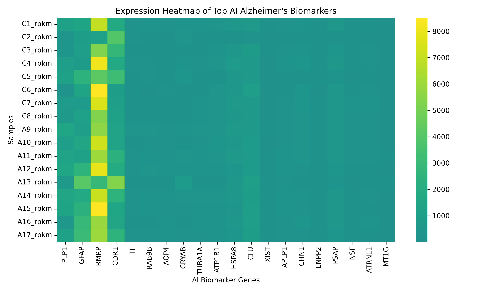
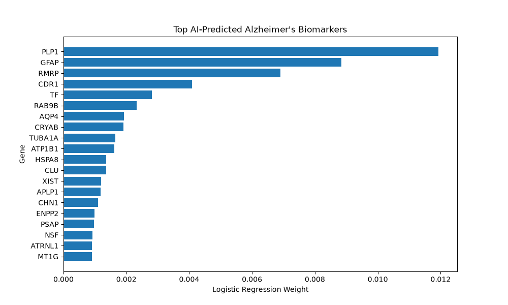
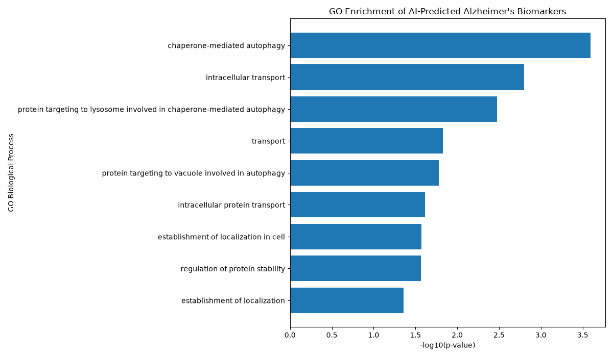
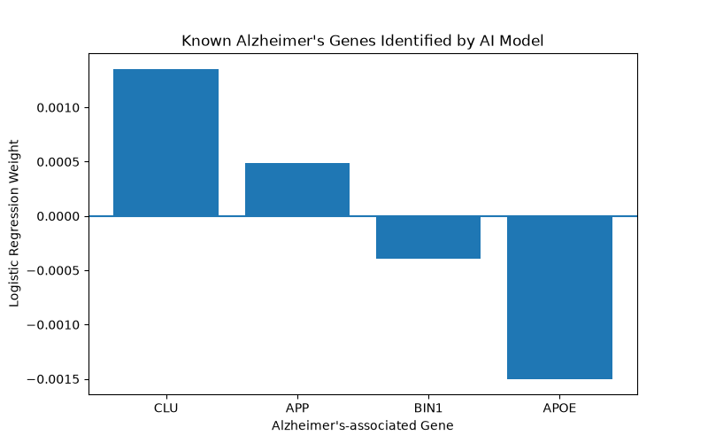

# Alzheimer's Disease RNA-seq Machine Learning Analysis

## Overview

This project uses machine learning and bioinformatics approaches to identify potential Alzheimer's disease biomarkers from RNA-seq gene expression data.

The workflow includes:
- RNA-seq data processing
- Machine learning classification
- Biomarker identification
- Alzheimer's gene validation
- Gene Ontology pathway analysis

---

## Dataset

**Source:** Gene Expression Omnibus (GEO)

**Dataset:** GSE53697 RNA-seq

Samples analyzed:
- 8 Control samples
- 9 Alzheimer's disease samples

---

## Methods

### Machine Learning
- Selected top 1,000 variable genes
- Trained Logistic Regression classifier
- Extracted gene importance weights

### Biological Analysis
- Validated biomarkers against known Alzheimer's genes
- Performed Gene Ontology enrichment analysis using g:Profiler

---

## Results

### Model Performance

Accuracy: **75%**

### Top AI-Predicted Biomarkers

- PLP1
- GFAP
- RMRP
- AQP4
- CLU
- APP

### Known Alzheimer's Genes Identified

- APOE
- APP
- CLU
- BIN1

### Enriched Biological Processes

- Chaperone-mediated autophagy
- Intracellular transport
- Protein targeting to lysosomes
- Regulation of protein stability

---

## Figures

Included:
- AI biomarker ranking
- Biomarker heatmap
- Gene validation analysis
- GO enrichment results

---

## Tools

- Python
- Pandas
- NumPy
- Scikit-learn
- Matplotlib
- g:Profiler
- RNA-seq analysis

---
## Results Visualization

### AI Biomarker Heatmap

### AI Biomarker Ranking

### Gene Ontology Enrichment

### Biomarker Validation

## Future Work

- Test additional Alzheimer's datasets
- Expand biomarker validation
- Apply additional machine learning approaches
- Integrate single-cell RNA-seq analysis

---

**Author:** Siddharth Vivek
